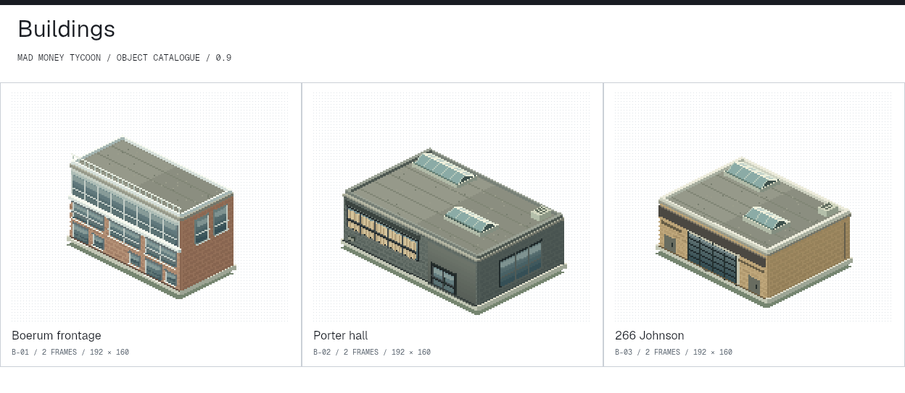

# Sprite refinement

The 32 × 16 projection and original pixel renderer are retained. All 43 previous registered objects were redrawn; the complete Chrysler attraction adds one assembly. The catalogue holds 44 objects and 136 frame slots, in the current art 0.10 manifest. The assets support the art study and Episode 01; the campaign is not built.

The [full object catalogue](../assets/sprite-catalogue/index.html) exposes native frames, cutaways and animation samples. The [0.7 / current comparison sheet](../assets/sprite-catalogue/sheets/refinement-comparison.png) shows selected same-object comparisons; the retired L-05 overlook is excluded.

## Art 0.10 replacement

L-05 is now the Voila delivery truck: a classic boxy step van with aluminium seams, divided windscreen, cab door, shutter, croissant and red/blue livery. Sixteen orientations and a 32-second service loop replace the former standalone stair. Johnson’s actual interior stair remains. The catalogue, scene, previews and downloads use the same renderer.

## Art 0.9 corrections

Supernova keeps its pavilion and orbital ornament, with a black body, chrome canopy, ribbed silver panels and bright fascia lettering. Johnson now follows the supplied loading-door frontage. Its interior has a stair descending from the mezzanine, a central white birch and the office cat. The scene clears the foreground sightline to that interior. The original 0.8 review is retained in the version archive.

## Source reading

| Object | Detail retained from the photograph | Change to the study |
|---|---|---|
| Chrysler | Long white body, low cabin, sloped glass, four round headlights, chrome belt, recessed wheels, broad rear lamp panel | 16 orientations; a paved driving circuit and boarding apron are invented attraction components |
| Reception | Unequal heights, rounded ends, deep scoops, flecked white surface and plants | Curved sampled geometry with surface lighting; open-air placement invented |
| Cat | Resting tabby, forepaws, lowered head, purple collar | Compact resting profile and restrained tail poses; no identity assigned |
| Coral booth | Coral frame, pale tiled divider, orange upholstery, separate table | Removed unrelated pink blocks; separated cushions, tabletop and supports |
| Stag | Near-frontal black sculpture, broad reflective antlers, four legs | Dark body planes, distinct legs and tapering metallic branches; park plinth invented |
| Inflatable | Blue/red columns, pointed orange/teal caps, yellow entrance frame and netting | Rounded inflated forms, seams and a clear entrance; a selectable courtyard layout, not a verified permanent installation |
| Solarium | Indoor planting and raised white planters | Invented glass pavilion; glints terminate within panes; shadows continue onto planter faces |
| Johnson stair | Orange rails, open treads and elevated mezzanine | Retained inside B-03; the external duplicate is retired |
| Voila truck | Red/blue bakery signage in the supplied references | Invented 1980s-style step van, sixteen headings and a service loop beside Porter |
| Buildings | Boerum’s three brick/glass frontages; Porter’s dark masonry, high curtain-backed windows and recessed entrance; Johnson’s yellow-brick loading frontage and white hall/orange mezzanine | Distinct facades and cutaways; unseen roof geometry remains a proposal |

Photo sources: [Matt Fry / 65 Porter](https://mattfryed.com/65porter), [Matt Fry / 266 Johnson](https://mattfryed.com/266-johnson), [PSF Projects / Madwell](https://www.psfprojects.com/workplace/madwell-creative-agency), and the supplied Boerum and 266 Johnson street images. The exact photo mappings and attribution limits remain in [office architecture research](office-art-research.md) and [campus discoveries](campus-discoveries.md).

## Craft references

- [Chris Sawyer / graphics up close](https://www.chrissawyergames.com/feature3.htm): detailed models rendered down to the game’s scale. Applied here as a form-and-lighting principle, with original code-drawn geometry.
- [Mark Inns / isometric car tutorial, 2009](https://markinns.com/archive/isometric-pixel-art-car.html): broad body shading, selective highlights and checking at native size. Applied to the sedan’s panel hierarchy and chrome.
- [Balamoot / Set of carz 2.0, 2009](https://pixeljoint.com/pixelart/47592.htm): a period isometric vehicle catalogue. Research reference only; no pixels or source assets copied.

The reception is a small curved mesh rasterized with surface normals. Car panels use per-pixel depth to prevent trim and glazing from being covered by a later body polygon. Other objects use shaped raster primitives and face-specific ramps. Static sprites are cached at native resolution; labels and document controls remain live HTML. This is still a one-camera art study, not a completed production asset set.

## Verification

Every previous object ID is compared with the retained 0.7 renderer. L-05 is an explicit replacement, not a refinement of the old stair. Every exported frame is checked against its atlas rectangle. Bounds and source hashes are checked during export. The existing six-leg fedora test verifies facing, motion, endpoint holds and both loading orders. The GIF encoder checks dimensions, timing and sampled decoded pixels.

Recognition is a visual judgment, separate from these mechanical checks. The comparison sheet and live park were inspected against the photo references; 0.7 renderers are retained for review.

## Next steps

Use these checks where they support the [P2 ordinary-work proof](#production/current-focus). Extra objects and alternate layouts are optional studies, not prerequisites for that proof.

Test object recognition at native scene scale, selection in overlapping areas, and the roof-on/off relationship without labels. The separate Episode 01 implements work and cash consequences. The next test checks whether players can read those consequences without help. New asset directions, additional camera views and a larger animation set remain uncommitted.
